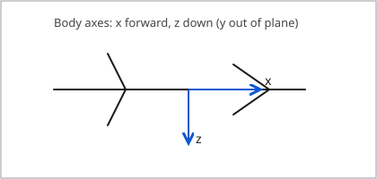

# PID Controller

Short reference for a PID loop. Related: [MATLAB Matrix Operations](../matlab/matrix-operations.md).

## Continuous form

$$
u(t) = K_p e(t) + K_i \int_0^t e(\tau)\, d\tau + K_d \frac{de(t)}{dt}
$$

where the tracking error is $e(t) = r(t) - y(t)$.

## State-space reminder

$$
\dot{x} = Ax + Bu, \qquad y = Cx + Du
$$

A rotation example with Greek letters, subscripts, and superscripts:

$$
R = \begin{bmatrix}
\cos\theta & -\sin\theta \\
\sin\theta & \cos\theta
\end{bmatrix}, \qquad
\alpha^2 + \beta_{1}^2 = \gamma^{(n)}
$$

## Tuning sketch (Python)

```python
def pid(e, e_int, e_dot, kp=1.0, ki=0.1, kd=0.05):
    """One PID step. e: current error, e_int: integral, e_dot: derivative."""
    return kp * e + ki * e_int + kd * e_dot
```

## Equivalent loop (C)

```c
float pid_step(float e, float e_int, float e_dot,
               float kp, float ki, float kd) {
    return kp * e + ki * e_int + kd * e_dot;
}
```

## Gains

| Gain | Effect | Risk if too large |
|------|--------|-------------------|
| $K_p$ | Faster response | Oscillation |
| $K_i$ | Removes steady-state error | Windup, overshoot |
| $K_d$ | Damps overshoot | Noise amplification |

!!! warning "Integrator windup"
    Clamp the integral term when the actuator saturates. Otherwise the integrator keeps growing while the output is stuck.

## Coordinate system


